<p align="center"></p>

# wiki-recall

**Your AI remembers everything. Yours doesn't. Fix that.**

[](LICENSE)
[]()
[](https://python.org)
[](https://www.typescriptlang.org/)
[](https://modelcontextprotocol.io)

| **~550 tokens** | **98.4% savings** | **93% recall** | **1,524 tests** |
|:---:|:---:|:---:|:---:|
| wake-up cost | vs dump-everything | hybrid search accuracy | all passing |

---

## Every Copilot session starts from scratch. This one doesn't.

You open your terminal on Monday. You haven't touched this project in two weeks. Instead of dumping your architecture, re-explaining your decisions, and reminding Copilot about the PR you left open — it already knows.

**wiki-recall** compiles your Copilot CLI session history into a persistent, layered knowledge base. ~550 tokens loads your entire working context. Everything else loads on demand. Your AI gets smarter the more you use it — automatically.

> *"The tedious part of maintaining a knowledge base is not the reading or the thinking — it's the bookkeeping."*
> — Gap Analysis Review

wiki-recall eliminates the bookkeeping. Decisions auto-capture. Bug patterns auto-extract. People names auto-resolve. Your voice auto-learns. You just work.

---

## The Proof

Reviewed by **9 domain experts** across memory systems, DevEx, security, and architecture. Validated with **18 simulation tests**.

### The Ablation

| Approach | Recall | Tokens/query | Verdict |
|:---------|:------:|:------------:|:--------|
| Wiki only (Karpathy) | ~60% | Low | Misses anything not yet compiled |
| Search only (RAG) | ~45% | High | Drowns in noise |
| **Hybrid (wiki-recall)** | **~93%** | **Low** | **Best of both worlds** |

### Key Numbers

| Metric | Result |
|:-------|:-------|
| Token savings vs dump-everything | **98.4%** (550 vs 13,000+ tokens) |
| Hybrid vs wiki-only recall | **+33 percentage points** |
| Hybrid vs search-only recall | **+49.5 percentage points** |
| Scale ceiling | **1,000 entities**, zero degradation |

> *"Obsidian is the IDE; the LLM is the programmer; the wiki is the codebase."*
> — Karpathy Pattern Expert

---

## What Makes This Different

### 🧠 Auto-Capture — Your AI Takes Its Own Notes

The #1 gap in every knowledge system: **it relies on you to write things down.** wiki-recall's `harvest.py` automatically mines your session history and extracts:

- **Decisions** — "decided to", "let's go with", "we're using"
- **Bug patterns** — "fixed by", "the fix was", "workaround:", "gotcha:"
- **Project updates** — sessions mentioning your known projects
- **New topics** — sessions about things not yet in your wiki
- **People mentions** — names referenced across sessions

```
📋 Decisions (2):
  + JWT tokens for authentication layer
  + WebSockets instead of polling for dashboard
🐛 Bug Patterns (1):
  + Null check missing before array access in parser
🧑 People Mentioned (2):
  + Sarah (3 sessions) — no wiki/people/sarah.md yet
```

Dry-run by default. Deduplicates. Filters out agent sessions. Backs up before writing. **Zero manual effort.**

### 🎭 Persona — Your AI Learns Your Voice

`persona.md` is a **self-training voice profile.** When Copilot drafts an email, PR description, or Teams message — it matches *your* voice, not generic AI-speak.

Say "that's not how I talk" and the persona immediately self-corrects. It evolves from feedback, not configuration.

### 🧑‍🤝‍🧑 People Routing — "Reply to Sarah" Just Works

Say a first name. Copilot resolves it instantly from `domains/comms.md` instead of searching the entire directory. Per-person context pages in `wiki/people/` store role, team, collaboration style. **harvest.py** auto-discovers new names across sessions.

### 🛡️ Staleness Detection — Dead Docs Don't Lie

Every wiki page gets `last_verified: YYYY-MM-DD`. Pages unverified for >60 days get flagged as **STALE**. `harvest.py` auto-updates verification timestamps when it touches a page. Stale docs are *"actively harmful"* — this catches them.

### 💾 Auto-Backup — The LLM Can't Forget to Back Up

`backup.ps1` creates timestamped copies before every write. But the real trick: the `copilot-instructions.md` template **tells Copilot to run it automatically.** The LLM doesn't need to remember — the instructions enforce it.

### 🔍 Proactive Pattern Surfacing — Don't Wait to Be Asked

Mention "debugging PowerShell issue" and Copilot proactively surfaces `wiki/patterns/powershell-gotchas.md` — **without you asking "any known fixes?"** Trigger matching rules in `copilot-instructions.md` handle the routing.

---

## The Architecture

### 5-Layer Memory Stack

```
L0  Identity         ~50 tokens    Always loaded
L1  Active Work      ~500 tokens   Always loaded
L2  Compiled Wiki    On demand     Domain-routed (Karpathy pattern)
L3  Semantic Search  On demand     ChromaDB embeddings
L4  Raw Sessions     On demand     Full conversation replay
```

**L0 + L1 = ~550 tokens.** That's your wake-up cost. Everything else loads only when needed.

### File Structure

```
~/.grain/                              YOUR DATA — local only, never pushed
├── brain.md                           L0+L1 hot cache (~550 tokens)
├── persona.md                         Self-training voice profile
├── actions.md                         Follow-ups, commitments, todos
├── decisions.md                       Things already decided (never re-debate)
├── wiki/
│   ├── index.md                       Master catalog
│   ├── projects/                      One page per project
│   ├── patterns/                      Bugs, gotchas, workarounds
│   ├── concepts/                      Tech concepts
│   └── people/                        One page per colleague
├── domains/
│   ├── comms.md                       People name → identity routing
│   └── [your-domains].md              Domain context files
├── reference/                         Hard gates, multi-agent rules
└── engine/
    ├── harvest.py                     Auto-capture from sessions
    ├── chromadb/                      Semantic search index
    └── .last_harvested                Auto-capture tracking
```

### Separation: Template vs Data

| | wiki-recall (this repo) | ~/.grain/ (your machine) |
|:--|:--|:--|
| **Contains** | Engine code, templates, scripts | Your personal brain, wiki, decisions |
| **Pushed to** | GitHub (public) | Nowhere (local only) |
| **PII** | None — all placeholders | Your name, projects, context |

---

## Real-World Use Cases

### Monday Morning Cold Start

```
# You open terminal. Haven't touched this project in 2 weeks.
# brain.md auto-loads. ~550 tokens.

> "What was I working on?"

# Copilot already knows your 3 active projects, the open PR,
# the retry logic decision, and the blocker on a teammate.
# Zero context dump. Productive in 30 seconds.
```

### Cross-Project Pattern Recognition

```
# You hit a rate-limiting bug in Project B.

> "Have I dealt with rate limiting before?"

# L3 semantic search finds a conversation from 3 months ago:
# "Exponential backoff with jitter, max 3 retries,
#  then dead-letter queue. Decided 2025-11-03."
# The exact solution. From a session you forgot existed.
```

### The Self-Training Loop

```
# You make a decision mid-conversation:
> "Let's use WebSockets instead of polling"

# Copilot proactively asks:
> "Save this decision?"

# You say yes. Written to decisions.md.
# Next month, it's there. No staging. No review folder.

# Later, you ask Copilot to draft an email. It sounds wrong.
> "That's too formal. I don't say 'Dear team'."

# persona.md self-updates. Next draft matches your voice.
```

### The "Handle Sarah's Message" Flow

```
> "Handle Sarah's last message"

# copilot-instructions.md → sees person name → reads comms.md
# comms.md → Sarah = Sarah Chen, Platform Team
# Teams search → finds Sarah's latest message
# persona.md → reads your voice before drafting
# Draft reply in YOUR voice → you confirm → sent
```

### Onboarding a New Team Member

```
# Day 1:   Setup wizard → empty brain.md, blank wiki
# Week 1:  brain.md has 5 projects, harvest found 12 decisions
# Month 1: 50+ wiki entities, patterns emerging, persona trained
# Month 3: Their AI knows their domain better than most teammates
```

---

## Getting Started

### Prerequisites
- Python 3.11+ with `pip`
- [Bun](https://bun.sh) (for TypeScript modules)
- Copilot CLI (for session history)

### Setup

```bash
git clone https://github.com/YOUR_USERNAME/wiki-recall.git
cd wiki-recall

pip install chromadb pyyaml          # Python engine
bun install                          # TypeScript modules

# Run the setup wizard
powershell -ExecutionPolicy Bypass -File scripts/setup.ps1
```

The wizard asks your name, GitHub identities, work domains, **communication style, greeting preference, and sign-off** — then generates your personal `~/.grain/` with `brain.md`, `persona.md`, `copilot-instructions.md`, and domain files.

### Daily Workflow

```bash
# Auto-capture decisions and patterns from your sessions
powershell -File scripts/harvest.ps1          # dry-run preview
powershell -File scripts/harvest.ps1 --auto   # write changes

# Check wiki health (staleness, orphans, coverage)
powershell -File scripts/lint.ps1

# Reindex for semantic search
python engine/indexer.py --incremental
```

---

## Engine Reference

### harvest.py — Auto-Capture

```bash
python engine/harvest.py                    # Dry-run since last harvest
python engine/harvest.py --auto             # Write changes
python engine/harvest.py --since 2026-04-08 # Harvest since date
python engine/harvest.py --status           # Show last harvest time
```

### indexer.py — ChromaDB Indexer

```bash
python engine/indexer.py                # Full reindex
python engine/indexer.py --incremental  # Only new sessions
python engine/indexer.py --stats        # Collection stats
```

### search.py — Hybrid Search

```python
from engine.search import GrainSearcher
s = GrainSearcher()
results = s.hybrid_search("why did we switch auth approach?")
```

### MCP Server — 10 Tools

| Tool | What it does |
|:-----|:-------------|
| `grain_wake_up` | Load L0+L1 identity context |
| `grain_search` | Hybrid search (wiki + semantic + decisions) |
| `grain_recall` | Read a specific wiki page |
| `grain_domains` | List domain files |
| `grain_domain` | Read a specific domain |
| `grain_decisions` | Search decisions |
| `grain_projects` | List project pages |
| `grain_patterns` | List pattern pages |
| `grain_session` | Get session details |
| `grain_status` | System health check |

### Scripts

| Script | Purpose |
|:-------|:--------|
| `setup.ps1` | Interactive onboarding wizard |
| `harvest.ps1` | Auto-capture decisions & patterns |
| `refresh.ps1` | Update brain.md from session_store |
| `compact.ps1` | Archive old entries, reset timestamps |
| `backup.ps1` | Timestamped backup (auto-prunes to 10) |
| `lint.ps1` | Wiki health check + staleness detection |

### TypeScript Modules

| Feature | Description |
|:--------|:------------|
| 5-Layer Memory | L0-L4 stack with automatic query routing |
| Paper Curation | arXiv + Semantic Scholar discovery, scoring |
| Visual Artifacts | Self-contained interactive HTML |
| Portable Scenarios | Save/recall working state via git |
| Schema Validation | JSON Schema Draft 2020-12 via Ajv |

### Benchmark Suites

| Suite | What it measures |
|:------|:-----------------|
| Token Efficiency | L0 → L0+L1 → full stack → naive dump |
| Recall & Precision | 200 queries by type |
| Routing Accuracy | Correct layer selection per query |
| Scale Stress | 10 → 1,000 entities |
| Layer Ablation | Wiki-only vs search-only vs hybrid |

```bash
bun run benchmark                          # Run all suites
bun run benchmark --suite token-efficiency  # Run one suite
```

---

## Test Results

| Category | Tests | Pass Rate |
|:---------|------:|:---------:|
| TypeScript unit + E2E | 1,399 | 100% |
| Python engine (indexer, search, MCP) | 16 | 100% |
| Python harvest (auto-capture + people) | 109 | 100% |
| Stress tests (chaos engineering) | 193 | 100% |
| Benchmark suites | 89 | 100% |
| **Total** | **1,524** | **100%** |

Stress-tested with: schema injection, FTS5 injection, SQL injection, concurrent CRUD, corrupt YAML, 10K-char queries, 100 concurrent router queries, path traversal, **harvest extraction, dedup validation, frontmatter updates, unicode, None fields, empty sessions, missing store**. One real bug found and fixed (listEntities crash on corrupt YAML).

```bash
bun test                                  # TypeScript (1,399 tests)
python -m pytest tests/                   # Python (125 tests)
```

---

## Design Decisions

Emerged from 9 expert reviews and 18 simulation tests:

- **Instructions file < 60 lines** — Copilot CLI truncates longer files
- **brain.md < 550 tokens** — L0+L1 only; everything else on-demand
- **Write-back is direct-with-ask** — no staging area (too much friction killed every alternative)
- **Proactive, not reactive** — Copilot asks "save this decision?" without being prompted
- **Persona self-trains** — say "that's not how I talk" and it corrects immediately
- **Session IDs link wiki to raw data** — full traceability from compiled entity to source conversation
- **Auto-capture by default** — harvest.py eliminates the #1 failure mode: forgetting to write things down

---

## Inspiration

Built on three proven patterns:

1. **[Andrej Karpathy](https://karpathy.ai/)** — Compile knowledge into structured entities, don't re-derive it. The L2 wiki layer is a direct implementation.
2. **[MemPalace](https://github.com/codelahoma/mempalace)** — Different memory types deserve different retrieval costs. The L0-L4 layered stack draws from this insight.
3. **[Second Brain (NicholasSpisak)](https://github.com/NicholasSpisak)** — Skill-based packaging with ingest/query/lint operations.

---

## License

[MIT](LICENSE)