<div align="center">

# 🧠 wiki-recall

### Compiled knowledge meets layered recall.

**Five memory layers. ~550 tokens to wake up. Wiki understanding + semantic search in one query.**

[](https://github.com/aviraldua93/wiki-recall/actions/workflows/ci.yml)
[](https://github.com/aviraldua93/wiki-recall/actions/workflows/ci.yml)
[](LICENSE)
[](https://www.typescriptlang.org/)
[](https://bun.sh)
[](https://modelcontextprotocol.io)

</div>

---

Every LLM memory system makes the same trade-off: **compile knowledge and lose recall**, or **store everything and understand nothing**. wiki-recall stacks both.

```bash
wiki-recall memory query "what's our retry strategy?"
```

---

## Memory Architecture

```mermaid
graph TD
    Q[Your Query] --> R[Router]
    R --> L0[🪪 L0: Identity<br/>~50 tokens • always loaded]
    R --> L1[📋 L1: Story<br/>~500 tokens • always loaded]
    R --> L2[📚 L2: Wiki<br/>on demand • domain routed]
    R --> L3[🔍 L3: Search<br/>on demand • BM25/FTS5]
    R --> L4[💾 L4: Sessions<br/>reference • full replay]

    style L0 fill:#1a1a2e
    style L1 fill:#16213e
    style L2 fill:#0f3460
    style L3 fill:#533483
    style L4 fill:#2c2c54
```



**L0 + L1 load on every query** — 550 tokens, always. L2–L4 activate only when needed, routed by query domain.

```bash
wiki-recall memory query "retry strategy" --layers L0,L1,L2
wiki-recall memory stats
wiki-recall memory identity
```

---

## How It Works

> 1. **Save** your working state → repos, branches, context, decisions
> 2. **Recall** on any machine → everything materializes instantly
> 3. **Compound** → every query makes the wiki smarter

---

## Why Not Just X?

| | Karpathy Wiki | RAG / MemPalace | **WikiRecall** |
|:---|:---:|:---:|:---:|
| **Compiled knowledge** | ✅ | ❌ | ✅ |
| **Semantic search** | ❌ | ✅ | ✅ |
| **~550 token wake-up** | ❌ | ❌ | ✅ |
| **Portable scenarios** | ❌ | ❌ | ✅ |
| **Paper curation** | ❌ | ❌ | ✅ |
| **Visual artifacts** | ❌ | ❌ | ✅ |
| **15-tool MCP server** | ❌ | ❌ | ✅ |

---

## Benchmarks

> **98.4%** token savings vs dump-everything
>
> **+33pp** recall over wiki-only
>
> **+49.5pp** recall over search-only
>
> **1,000** entities with zero degradation

| Approach | Recall | Tokens | Understands? | Searches? |
|:---|:---:|:---:|:---:|:---:|
| Wiki only (Karpathy) | ~60% | Low | ✅ | ❌ |
| Search only (RAG) | ~45% | High | ❌ | ✅ |
| **Hybrid (WikiRecall)** | **~93%** | **Low** | **✅** | **✅** |

> All benchmarks use reproducible seeded mock data. Zero API costs.

---

## Quick Start

```bash
git clone https://github.com/aviraldua93/wiki-recall.git
cd wiki-recall && bun install && bun link
wiki-recall init
wiki-recall create my-api --template web-api
```

---

## Features

| | | | |
|:---|:---|:---|:---|
| 🧠 **5-Layer Memory** | 📦 **Portable Scenarios** | 💾 **Save & Recall** | 🛠️ **Pluggable Skills** |
| 📚 **Knowledge Wiki** | 📄 **Paper Curation** | 🕸️ **Visual Artifacts** | 🔌 **MCP Server (15 tools)** |
| 🔄 **Cross-Machine Sync** | 🤝 **Team Handoffs** | 🏗️ **5 Templates** | 🔍 **FTS5 Search** |
| ✅ **Schema Validation** | 🧩 **Skill Promotion** | | |

---

## Portable Scenarios

wiki-recall packages your working state — repos, branches, skills, context — into a **resumable scenario** that syncs via Git.

```bash
# Friday — save state
wiki-recall save api-project \
  --summary "Retry handler done, integration tests next" \
  --next-step "Write tests for exponential backoff"

# Monday — instant resume
wiki-recall recall api-project
```

**Zero context loss.** Push from laptop, pull on desktop. Hand off to a teammate as a PR. No cloud service — just git.

```bash
wiki-recall push my-project
wiki-recall pull my-project
wiki-recall handoff my-project --to teammate --pr
```

---

## Knowledge Wiki

The L2 layer. Implements [Andrej Karpathy's methodology](https://karpathy.ai/): **entities, not documents.**

Each entry is a Markdown file with YAML frontmatter — mental models with source citations, contradiction tracking, and lifecycle status (`draft` → `reviewed` → `needs_update`).

```bash
wiki-recall knowledge search "retry patterns"
wiki-recall knowledge list --type concept
wiki-recall knowledge get a2a-protocol
```

---

## Paper Curation & Visualization

Automated discovery from **arXiv** and **Semantic Scholar**. Papers scored on a 0–1 relevance scale, deduplicated, and **ingested directly into the wiki** as Karpathy-style entities.

```bash
wiki-recall papers search "transformer architectures" --limit 10
wiki-recall papers curate --topics "agents,retrieval" --min-score 0.3
wiki-recall papers ingest arxiv-2301-07041
```

Generate **self-contained interactive HTML** visualizations — knowledge graphs, topic clusters, timelines, and research dashboards.

```bash
wiki-recall visualize --type knowledge-graph --output graph.html
wiki-recall visualize --type research-landscape --open
```

---

## MCP Server

**15 tools** exposed via the [Model Context Protocol](https://modelcontextprotocol.io) — knowledge management, scenario ops, memory queries, paper curation, and visualization. Any LLM, any IDE.

```bash
wiki-recall mcp              # Start on stdio
wiki-recall mcp --list-tools # See all 15 tools
```

```json
{
  "mcpServers": {
    "wikirecall": {
      "command": "wikirecall",
      "args": ["mcp"]
    }
  }
}
```

---

## Skills & Templates

| Skill | What it does |
|:---|:---|
| `code-review` | Five-layer review: security → correctness → style → performance → testing |
| `ci-monitor` | GitHub Actions monitoring and failure diagnosis |
| `pr-management` | Full PR lifecycle — creation, review, merging |
| `session-management` | Checkpointing and cross-machine context transfer |
| `multi-agent` | Parallel agent orchestration via docs-as-bus |
| `paper-curation` | Research discovery, scoring, and wiki ingestion |
| `research-loop` | End-to-end research: curate → ingest → visualize |

| Template | What you get |
|:---|:---|
| `web-api` | REST API with auth, tests, CI, and contracts |
| `frontend-app` | Dashboard with component library and design system |
| `infra-pipeline` | CI/CD, build system, and deploy config |
| `research-paper` | LaTeX paper with experiment tracking |
| `multi-agent` | A2A orchestration with crew coordination |

```bash
wiki-recall create my-project --template web-api
```

---

## Tech Stack

| Component | Technology |
|:---|:---|
| Runtime | [Bun](https://bun.sh) (TypeScript, ESM) |
| CLI | [Commander.js](https://github.com/tj/commander.js) |
| Validation | [Ajv](https://ajv.js.org/) — JSON Schema Draft 2020-12 |
| Storage | GitHub repos (git-based sync, zero infra) |
| Search | FTS5 via [better-sqlite3](https://github.com/WiseLibs/better-sqlite3) |
| MCP | [Model Context Protocol](https://modelcontextprotocol.io) (15 tools) |
| Testing | Bun test runner (1,060 tests) |

---

## Portfolio

wiki-recall is part of a broader AI agent engineering portfolio:

| Project | What it does |
|:---|:---|
| [a2a-crews](https://github.com/aviraldua93/a2a-crews) | Multi-agent orchestration via Google's A2A protocol |
| [ag-ui-crews](https://github.com/aviraldua93/ag-ui-crews) | Agent ↔ Human real-time UI streaming |
| [rag-a2a](https://github.com/aviraldua93/rag-a2a) | Agent knowledge retrieval with RAG pipelines |
| [agent-traps-lab](https://github.com/aviraldua93/agent-traps-lab) | Adversarial testing and failure-mode analysis |
| [wiki-vs-rag](https://github.com/aviraldua93/wiki-vs-rag) | Head-to-head: wiki vs. RAG evaluation |
| [multi-agent-playbook](https://github.com/aviraldua93/multi-agent-playbook) | Patterns for multi-agent systems |
| **wikirecall** | **The developer memory layer — you are here** |

---

## Credits

wiki-recall stands on three ideas:

- **[Andrej Karpathy](https://karpathy.ai/)** — The "compiled wiki" methodology. Knowledge as structured entities, not document dumps. WikiRecall's L2 layer is a direct implementation.
- **[MemPalace](https://github.com/codelahoma/mempalace)** — The layered memory architecture. Different memory types should have different retrieval costs. WikiRecall's L0–L4 stack is inspired by this.
- **[Elvis Saravia / DAIR.AI](https://github.com/dair-ai)** — Research paper curation as a first-class engineering activity. The discovery → scoring → ingestion pipeline draws from DAIR.AI's work.

---

## Contributing

See [CONTRIBUTING.md](CONTRIBUTING.md) for guidelines.

```bash
git clone https://github.com/aviraldua93/wiki-recall.git
cd wiki-recall && bun install && bun test
```

## License

[MIT](LICENSE) © Aviral Dua
