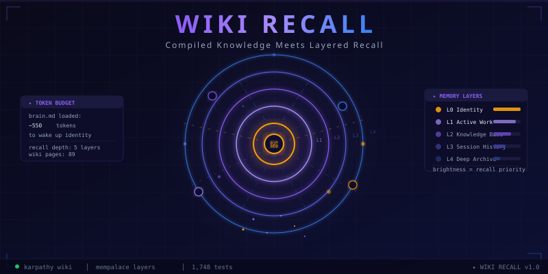

<p align="center"></p>

# wiki-recall

wiki-recall is a Bun/TypeScript CLI for saving, recalling, and searching project context so a future coding session can resume with less re-explanation.

[](LICENSE)
[]()
[](https://bun.sh)
[](https://python.org)

## What it does

- Stores working scenarios: repositories, skills, current context, next steps, blockers, and notes.
- Recalls a scenario later by restoring saved context and optionally syncing repositories.
- Manages a local knowledge wiki and search index for reusable project knowledge.
- Can run as an MCP server over stdio for editor/agent integration.

## Quickstart / install

Prerequisites:

- [Bun](https://bun.sh) 1.1 or later
- Git
- Python 3.11+ only if you use the Python engine scripts in `engine/`

```bash
git clone https://github.com/aviraldua93/wiki-recall.git
cd wiki-recall
bun install
```

Optional Python engine dependencies:

```bash
python -m pip install chromadb PyYAML
```

## How to run

Run the CLI from source:

```bash
bun run dev --help
bun run dev init
bun run dev create my-project --template web-api
bun run dev save my-project --summary "Implemented retry handler" --next-step "Add tests"
bun run dev recall my-project
```

Set up a local `~/.grain` knowledge base with the PowerShell wizard:

```powershell
powershell -ExecutionPolicy Bypass -File scripts/setup.ps1 -Quick
powershell -ExecutionPolicy Bypass -File scripts/setup.ps1 -Interview
```

Quick Setup (`-Quick`) creates a minimal local brain from form prompts. Deep Interview (`-Interview`) uses Copilot CLI prompts to interview you and mine session history for richer project context. All data stays local unless you explicitly sync it.

Build a standalone executable:

```bash
bun run build
./wikirecall --help        # macOS/Linux
.\wikirecall.exe --help    # Windows
```

Other useful commands:

```bash
bun run dev list
bun run dev knowledge --help
bun run dev visualize --help
bun run dev mcp
bun run dev benchmark --help
```

## How to test

```bash
bun run lint       # TypeScript type check
bun run test:unit  # unit tests
bun run test:e2e   # local end-to-end workflow tests
bun run test       # full Bun test suite
```

Current validation: `bun run test` runs 1,748 tests across 59 files. The e2e suite uses local temporary workspaces and does not require live services.

## Project layout

- `src/cli/` — CLI entry point and commands
- `src/scenario/` — scenario create, recall, save, handoff, teardown, push, and pull logic
- `src/knowledge/` — knowledge entity storage, search, and visualization
- `src/memory/` — layered memory configuration and routing
- `engine/` — optional Python indexing/harvest helpers
- `skills/`, `templates/`, `schemas/` — packaged skills, starter files, and validation schemas
- `tests/` — Bun unit and e2e tests

## License

[MIT](LICENSE)
